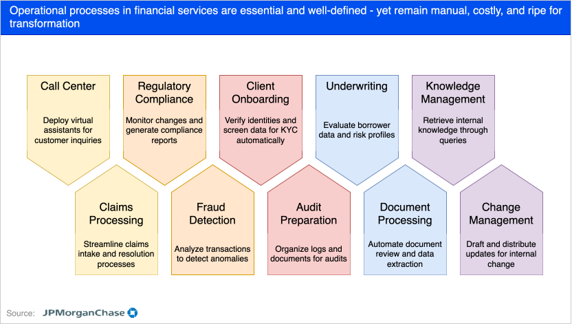
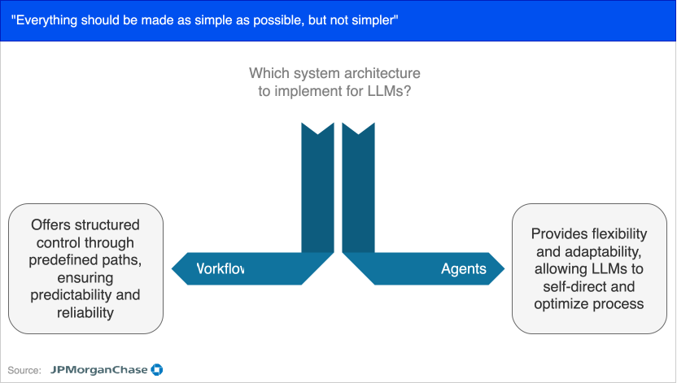
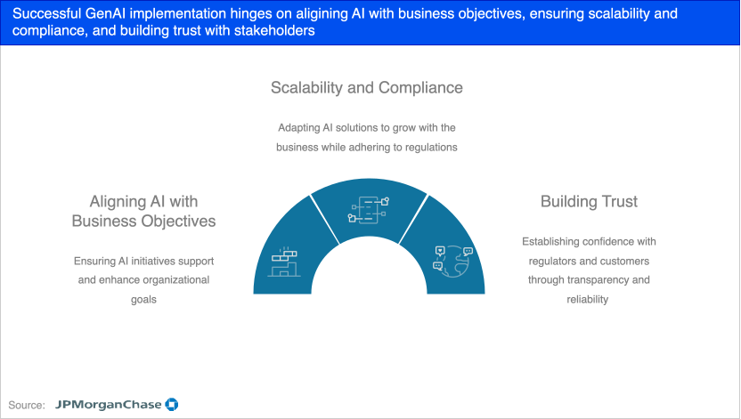

# AI in Finance - JPMC Presentation Excerpts

## Agents can manage complex operational workflows at scale

| 🛠 Operational Workflow Characteristic                                 | 🤖 Agentic Capability                                                                 |
|------------------------------------------------------------------------|----------------------------------------------------------------------------------------|
| Multi-step and sequential tasks                                        | Can orchestrate tasks through multi-step decision chains                               |
| Rule-based with contextual exceptions                                 | Adaptable reasoning; can follow rules but override with context-aware judgment         |
| High-volume and repetitive                                             | Scalable automation of repetitive tasks without fatigue                                |
| Cross-functional (spanning departments, tools, or systems)            | Ability to interact with APIs, databases, and tools across systems                     |
| Require frequent decision-making or prioritization                    | Capable of autonomous decision-making based on goals, thresholds, or policies          |
| Include structured + unstructured data inputs                         | Process both document-style inputs and structured forms                                |
| Depend on real-time or near-real-time responses                       | Can continuously monitor and trigger actions dynamically                               |
| Require monitoring, validation, and error handling                    | Built-in feedback loops (e.g. eval + optimize, hallucination checks, retry logic)      |
| Often involve escalation or fallback scenarios                        | Can escalate to humans or alternate flows when confidence is low                       |
| Need adaptability to changing business rules or compliance needs      | Agents can be reprogrammed or fine-tuned without full retraining or code changes       |

